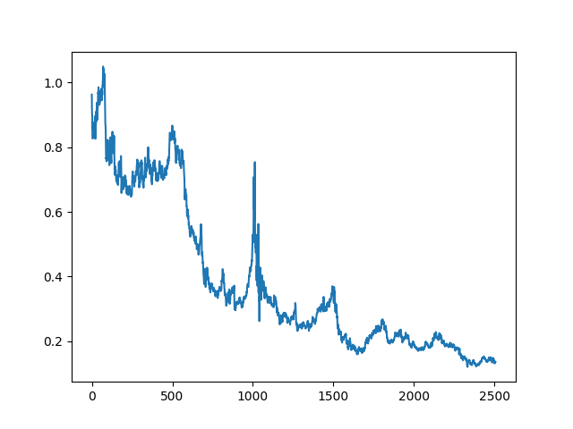
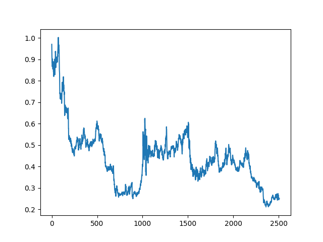
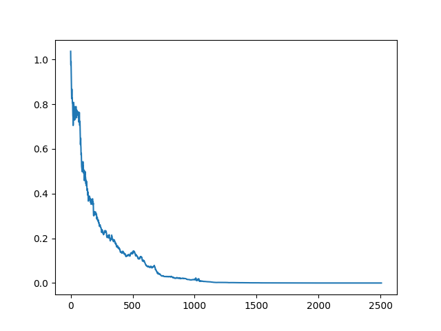
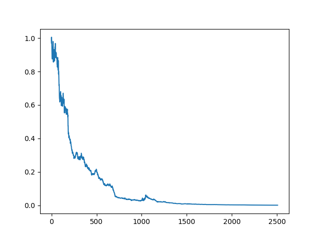

# evaluating-model-prediction-1

In crude oil, there are 2 benchmark.

- WTI (ticker: CL=F) is the benchmark price for US. They are
controlled and affected by US Market, demand, bottleneck for
shipping, etc.
- Brent (ticker: BZ=F) is the benchmark price for Europe, Asia,
and Middle East (basically global). 

Why they are different ?

WTI is landlocked at cushing (America) which mean that its
targeted market can only be around America making it sensitive to America storage constraint, pipeline, and its market.

Brent on the other hand, located near sea which mean it can reached out more country. That's why Brent usually regarded as the global benchmark.

I add checkData.py to check whether they differ that much or not
and after running it, I got
```
diff train: 100.0%
diff test: 100.0%
```
which mean that they are truly different

In evaluating the model we'll use 4 test
1. MSE (Mean square error)
2. Directional
3. Sharpe
4. Plot cumulative return

To calculate the sharpe and cumulative return is basically the model will have prediction on price, if its return >= 1 then we take long position, if < 1 then we short the position. And then we just use the sign and multiply it to the actual return.

All of these test will be checked on log(return) which is directly from the data we have (because in getData we have change the price into log(return))

In both model, I use rolling test with window = 5
So I use (t-1, t-2, t-3, t-4, t-5) to predict t

Model 1:
- In this model I only put current return = previous return

    For US benchmark the result is
    - min/max: -0.37662331847024166 0.45210728089346175
    - mean/std: -0.00035587515739695177 0.02949377964237372
    - any <= -1?: False
    - min(1+sr): 0.6233766815297583
    - final wealth: 0.13630589059943227
    - MSE for Model 1 in data US: 0.0019172227653489087
    - Directional for Model 1 in data US: 0.4946150777822098
    - Sharpe for Model 1 in data US: -0.1915817540188265
    - Cumulative result: 

    For global benchmark the result is
    - min/max: -0.31160968745633666 0.24099844791455216
    - mean/std: -0.0002567547254790919 0.024171375016290554
    - any <= -1?: False
    - min(1+sr): 0.6883903125436633
    - final wealth: 0.25046517602580154
    - MSE for Model 1 in data Global: 0.0012066913102423637
    - Directional for Model 1 in data Global: 0.4882329477463103       
    - Sharpe for Model 1 in data Global: -0.1686568531888287
    - Cumulative result: 

Model 2:
- In this model I use LinearRegression with lag-1

    For US benchmark the result is
    - min/max: -0.45210728089346175 0.37662331847024166
    - mean/std: -0.00425552923271976 0.029187205754225308
    - any <= -1?: False
    - min(1+sr): 0.5478927191065383
    - final wealth: 7.408345062099908e-06
    - MSE for Model 2 in data US: 0.0018938431762532367
    - Directional for Model 2 in data US: 0.5028866123398561
    - Sharpe for Model 2 in data US: -2.3149838337737063
    - Cumulative result: 

    For global benchmark the result is
    - min/max: -0.1461307745596312 0.31160968745633666
    - mean/std: -0.002878372826417331 0.02400068714157887
    - any <= -1?: False
    - min(1+sr): 0.8538692254403688
    - final wealth: 0.00035613397079423587
    - MSE for Model 2 in data Global: 0.0013218644063251136
    - Directional for Model 2 in data Global: 0.5031149319599577       
    - Sharpe for Model 2 in data Global: -1.904189974514823
    - Cumulative result: 


So, the conclusion is both models perform poorly because daily oil log returns have little predictable structure from just recent returns, so from sign-based trades are close to random (Directional ≈ 0.50). Model 2 can be worse than “previous = now” because it refits a regression on only 4 effective training points per step, making the slope/intercept highly unstable. Small estimation noise flips the predicted sign and ended up on the wrong side of bigger moves. Since the strategy is always long/short (never cash), even a small negative average daily return compounds over ~2500 days / test and drives cumulative wealth toward 0, which is why cash looks better.

